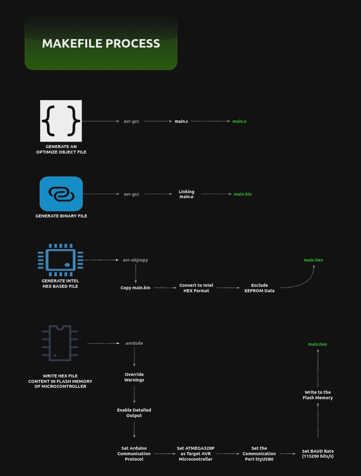

### Description
#

<br />

https://github.com/kentlouisetonino/hw-blinking-LED/assets/69438999/bdaa7ed7-b38d-40ff-909b-63efa0d9c825

<br />

> - A blinking LED Arduino project written in C language.

> - Based on the current code, the LED will light up for 2
    seconds, then will turn off for 1 second, and will light
    again. This is an infinite cycle process.

<br />
<br />


### System Design
#

<br />



<br />
<br />


### Local Development
#

> - This works well in Linux based system.

> - Install the necessary tools inorder to interact
    with Arduino without the IDE.

```bash
# Standard library for Atmel AVR devices.
# This contains most of the features required by the ISO C standard.
sudo apt install avr-libc

# A program for downloading and uploading on-chip memories of Atmel AVR Microcontroller.
sudo apt install avrdude

# A program to assemble and manipulate binary and object files for the AVR architecture.
sudo apt install binutils-avr

# GCC C cross compiler for AVR.
sudo apt install gcc-avr
```

> - Take note that the library headers might be placed here `/usr/lib/avr/include`.

> - Run the command below to execute the commands specified in `Makefile`.

```bash
# Change directory to the root of the project.
# Execute the MakeFile and upload in the Arduino microcontroller.
make
```
